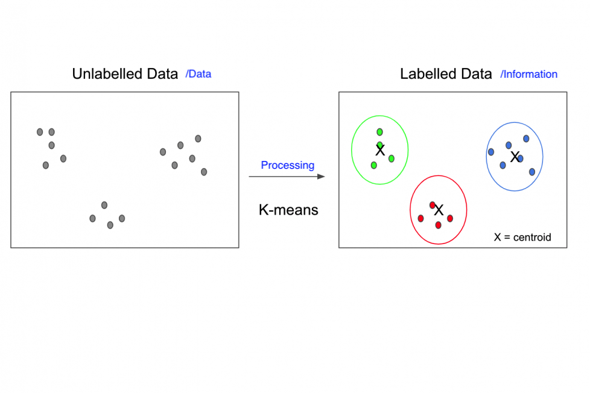

# CSCI100: Introduction to Computing
# Dr. Ning Zhang
# Topic 1: Computer Architectures

# 1. What is Computer?

## 1.1 Computers are everywhere.
+ The modern electronic computer is certainly one of the most influential inventions of the twentieth century.
+ Computers have entered almost every arena of human society. They operate in our homes, our workplaces, and our schools. They come in so many shapes and sizes that it is sometimes difficult to recognize them: while laptop and desktop computers are commonplace, ATM machinecomputers can also be found in home electronics, automobiles, airplanes, automatic teller machines (ATMs), security systems, and many other devices and situations. Many of the world's societies depend heavily on computers in the operation of their transportation systems, commerce, utilities, law enforcement, governance, and more.

## 1.2 What is computer?
+ A computer is an electronic device, operating the instructions stored in its own memory.
+ A computer can accept data, process the data, produce results, and store the results for future use.
+ A typical computer architecture
  - Note that 
Primary memory usually refers to Random Access Memory (RAM), while secondary storage refers to devices such as hard disk drives, solid state drives, removable “USB” drives, CDs, and DVDs.

## 1.3 Information Processing Cycle

+ Data v.s. Information
  - **Data** is a collection of unprocessed items, which can include text, numbers, images and so on.
  - **Information** conveys meaning and is useful to people.

+ Example
  - At a restaurant, a single customer’s bill amount is data. However, when the restaurant owners collect and interpret multiple bills over a range of time, they can produce valuable information, such as what menu items are most popular and whether the prices are sufficient to cover supplies, overhead, and wages.
  - Data Mining - Clustering
  
  
